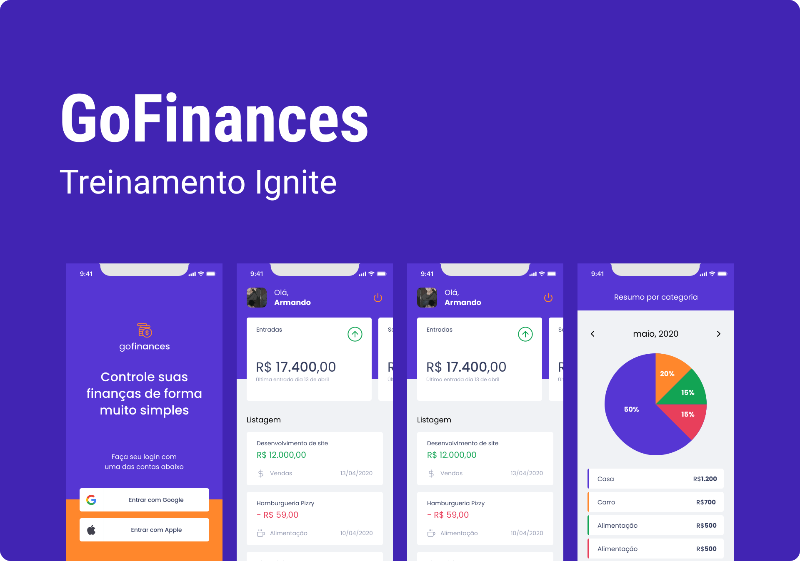

<h1
  align="center"
>
  
</h1>

<h3
    align="center"
>
  Academic app for financial management built on Rocketseat Ignite
</h3>

<h3
  align="center"
>
  
</h3>

  <a
    href="#building-the-project"
  >
    Building the project
  </a>&nbsp;&nbsp;&nbsp;
  <a
    href="#screens"
  >
    Screens
  </a>&nbsp;&nbsp;&nbsp;
  <a
    href="#Layout"
  >
    Layout
  </a>&nbsp;&nbsp;&nbsp;
  <a
    href="#Technologies"
  >
  Technologies
  </a>&nbsp;&nbsp;&nbsp;
  <a
    href="#About-me"
  >
  About me
  </a>

 

## BUILDING THE PROJECT

 

## SCREENS

 

## LAYOUT

 

## TECHNOLOGIES

 

## ABOUT ME

 
